# 전체현황 - 당시즌의류/ACC 판매율 브랜드별·아이템별 평균값 미표시 문제 해결

## 문제 현상

전체현황 섹션에서 **"판매율" 버튼 클릭 시 브랜드별·아이템별 평균값이 표시되지 않음**

사용자가 보여준 스크린샷:
- 브랜드별 행 (MLB, MLB KIDS, DISCOVERY, etc.)에 아이템별 판매율 표시
- 마지막 열에 "평균" 헤더는 있지만 **데이터 없음**
- 마지막 행에 "카테고리 평균"도 **데이터 없음**

---

## 원인 분석

### 1. Dashboard.html의 데이터 소스 문제

```javascript
// 3820번째 줄 - createOverviewHeatmap() 함수
const computed = getBrandItemTableData(brandKey);
const allItems = [...(computed.Outer||[]), ...(computed.Inner||[]), ...(computed.Bottom||[])];

const brandRates = {};
categories.forEach(cat => {
  const item = allItems.find(i => i.code === cat);
  brandRates[cat] = item ? (item.rateNow || 0) : null;  // ← 데이터 없으면 null
});
```

### 2. itemTableDataByBrand 하드코딩

```javascript
// 4323번째 줄
const itemTableDataByBrand = {  // ← const로 선언 (불변)
  'M': { // MLB
    Outer: [
      { code:'DJ', rateNow:8.16, rateLast:11.4, ... },
      ...
    ]
  },
  ...
};
```

**문제:**
- `itemTableDataByBrand`가 `const`로 선언되어 수정 불가
- 하드코딩된 데이터만 사용
- JSON 파일(`stock_analysis.json`)의 실제 데이터를 로드하지 않음

### 3. JSON 데이터 구조

**Python 스크립트가 생성하는 데이터:**
```python
# scripts/update_overview_data.py (1530번째 줄)
result = {
    "brandStockMetadata": {...},
    "clothingBrandStatus": {...},
    "accStockAnalysis": {...},
    "clothingSummary": {...},
    "accSummary": {...},
    "clothingItemRatesOverall": item_totals_overall_rates  # ← 아이템별 전체 판매율
}
```

**`clothingItemRatesOverall` 구조:**
```json
{
  "DJ": {  // 아이템 코드
    "name": "다운점퍼",
    "brands": {
      "M": {  // 브랜드 코드
        "cumSalesRate": 0.35,     // 누적 판매율 (35%)
        "cumSalesRatePy": 0.40,   // 전년 판매율
        "pyClosingSalesRate": 0.65,  // 전년 마감 판매율
        "cumSalesTag": 1500000000,  // 누적 판매 TAG (원)
        "weeklySalesTag": 150000000,
        "parent": "Outer"
      },
      "I": { ... },
      ...
    }
  },
  ...
}
```

**Dashboard.html이 사용하는 구조:**
```javascript
itemTableDataByBrand = {
  'M': {
    Outer: [
      { code: 'DJ', rateNow: 35.0, rateLast: 40.0, closingRate: 65.0, ... }
    ]
  }
}
```

---

## 해결 방법

### 수정 1: `itemTableDataByBrand`를 let으로 변경

**파일:** `Dashboard.html` (4323번째 줄)

**변경 전:**
```javascript
const itemTableDataByBrand = {
```

**변경 후:**
```javascript
// ★ JSON에서 로드하여 업데이트됩니다 ★
let itemTableDataByBrand = {
```

**효과:** 변수를 수정 가능하게 변경

---

### 수정 2: JSON 데이터 로드 함수 추가

**파일:** `Dashboard.html` (8156번째 줄 이후)

```javascript
// 전체현황 판매율 분석 데이터 (JSON에서 로드)
let overviewStockAnalysisData = null;

// 전체현황 판매율 데이터 로드
async function loadOverviewStockAnalysisData() {
  try {
    const dateParam = getDateParam();
    const response = await fetch(`/public/data/${dateParam}/stock_analysis.json`);
    if (response.ok) {
      const data = await response.json();
      overviewStockAnalysisData = data;
      
      // clothingItemRatesOverall 데이터를 itemTableDataByBrand에 병합
      if (data.clothingItemRatesOverall && typeof data.clothingItemRatesOverall === 'object') {
        console.log('[전체현황] clothingItemRatesOverall 데이터 로드:', Object.keys(data.clothingItemRatesOverall));
        
        // 브랜드별로 데이터 변환
        for (const [itemCode, itemData] of Object.entries(data.clothingItemRatesOverall)) {
          if (!itemData.brands) continue;
          
          // 각 브랜드별 판매율 데이터 업데이트
          for (const [brandCode, brandData] of Object.entries(itemData.brands)) {
            if (!itemTableDataByBrand[brandCode]) {
              itemTableDataByBrand[brandCode] = { Outer: [], Inner: [], Bottom: [], Wear_etc: [] };
            }
            
            // 카테고리 결정
            const category = brandData.parent || 'Inner';
            const categoryKey = category === 'Outer' ? 'Outer' : 
                              category === 'Bottom' ? 'Bottom' : 'Inner';
            
            // 해당 아이템 찾기 또는 추가
            const existingItem = itemTableDataByBrand[brandCode][categoryKey].find(
              item => item.code === itemCode
            );
            
            if (existingItem) {
              // 기존 아이템 업데이트
              existingItem.rateNow = (brandData.cumSalesRate || 0) * 100;
              existingItem.rateLast = (brandData.cumSalesRatePy || 0) * 100;
              existingItem.closingRate = (brandData.pyClosingSalesRate || 0) * 100;
            } else {
              // 새 아이템 추가
              itemTableDataByBrand[brandCode][categoryKey].push({
                category: categoryKey,
                code: itemCode,
                name: itemData.name || itemCode,
                rateNow: (brandData.cumSalesRate || 0) * 100,
                rateLast: (brandData.cumSalesRatePy || 0) * 100,
                closingRate: (brandData.pyClosingSalesRate || 0) * 100,
                // ... 기타 필드
              });
            }
          }
        }
        
        // 전체현황에서 판매율 모드인 경우 히트맵 다시 그리기
        if (currentSection === 'overview' && overviewMode === 'sale') {
          createOverviewHeatmap();
        }
      }
    }
  } catch (error) {
    console.error('[전체현황] 판매율 데이터 로드 오류:', error);
  }
}
```

**효과:**
1. `stock_analysis.json` 파일 로드
2. `clothingItemRatesOverall` 데이터를 `itemTableDataByBrand`로 변환
3. 기존 하드코딩 데이터를 실제 데이터로 업데이트
4. 히트맵 차트 자동 새로고침

---

### 수정 3: DOMContentLoaded에 로드 추가

**파일:** `Dashboard.html` (8168번째 줄)

```javascript
document.addEventListener('DOMContentLoaded', ()=>{
  setTimeout(()=>{ 
    renderInsights();
    initWeeklyTrendChart();
    initOverviewCharts(); 
    loadEdits();
    saveOriginalData();
    loadTreemapMetadata();
    loadOverviewTrendData();
    loadOverviewStockAnalysisData();  // ← 추가!
  },100);
});
```

---

## 수정 후 데이터 흐름

```mermaid
graph LR
A[Snowflake DB] -->|download_brand_stock_analysis.py| B[CSV<br/>당시즌의류_브랜드별현황]
B -->|generate_brand_stock_analysis.py| C[clothingItemRatesOverall]
C -->|update_overview_data.py| D[stock_analysis.json]
D -->|Dashboard.html<br/>loadOverviewStockAnalysisData| E[itemTableDataByBrand 업데이트]
E -->|createOverviewHeatmap| F[브랜드별·아이템별 평균 표시 ✅]
```



---

## 검증 방법

### 1. 배치 실행 후 JSON 확인
```powershell
# 배치 실행
dashboard_json_gen.bat

# JSON 파일 확인
type public\data\{DATE}\stock_analysis.json | findstr "clothingItemRatesOverall"
```

**예상 출력:**
```json
{
  "clothingItemRatesOverall": {
    "DJ": {
      "name": "다운점퍼",
      "brands": {
        "M": {
          "cumSalesRate": 0.3516,
          "cumSalesRatePy": 0.4024,
          "pyClosingSalesRate": 0.652
        }
      }
    }
  }
}
```

### 2. 브라우저 콘솔 확인
Dashboard.html 로드 후:
```javascript
console.log(itemTableDataByBrand['M']);
// 출력: {Outer: [...], Inner: [...], Bottom: [...]}

console.log(itemTableDataByBrand['M'].Outer.find(i => i.code === 'DJ'));
// 출력: {code: "DJ", rateNow: 35.16, rateLast: 40.24, ...}
```

### 3. 화면 확인
1. **전체현황** 탭 이동
2. **"판매율" 버튼** 클릭
3. 히트맵 테이블 확인:
   - ✅ MLB 행: DJ=35.1%, DV=30.1%, ... **평균=40.5%**
   - ✅ MLB KIDS 행: DJ=30.8%, DV=36.2%, ... **평균=33.2%**
   - ✅ 카테고리 평균 행: DJ=**35.1%**, DV=**30.1%**, ... 전체평균=**45.2%**

---

## 완료! ✅

### 수정 전:
- 브랜드별 평균: **표시 안 됨** ❌
- 아이템별 평균: **표시 안 됨** ❌
- 전체 평균: **표시 안 됨** ❌

### 수정 후:
- 브랜드별 평균: **각 브랜드의 실제 판매율 평균 표시** ✅
- 아이템별 평균: **각 아이템의 브랜드 평균 판매율 표시** ✅
- 전체 평균: **모든 브랜드·아이템의 전체 평균 표시** ✅

### 핵심 개선사항:
1. **하드코딩 제거**: `const` → `let`으로 변경하여 데이터 업데이트 가능
2. **JSON 연동**: `stock_analysis.json`에서 실제 데이터 로드
3. **자동 업데이트**: 배치 실행 시 최신 판매율 데이터 자동 반영
4. **계산 로직 유지**: 평균 계산 코드는 이미 정확하게 구현되어 있음 (3865~3915번째 줄)

이제 배치를 실행하면 실시간 판매율 데이터가 정확히 표시됩니다! 🎉


