# 전체현황 - 월중 누적 매출 추이 과다 표시 문제 해결

## 문제 현상

스크린샷에서 **12/21일 주차별 매출이 약 400,000 (40만)으로 과도하게 표시**됨
- 정상 값: 약 57억원
- 표시된 값: 약 57,000억원 (100배 과다)

---

## 원인 분석

### 1. 데이터 단위 불일치

**CSV 원본 데이터:**
```csv
브랜드,구분,종료일,유통채널,채널명,실판매출
I,당년,2025-09-21,01,백화점,575567750  # 원(won) 단위
```

**Python 스크립트 (update_overview_data.py):**
```python
# 1664~1666번째 줄
# 백만원 단위로 변환
current_data.append(round(current_sum / 1000000, 1))  # 575,567,750 → 576 (백만원)
```

**Dashboard.html:**
```javascript
// 8242번째 줄
scales: { 
  y: { 
    title: { text: '매출 (억원)' }  // ← 차트 y축은 "억원"이라고 표시!
  }
}
```

### 문제:
- CSV는 **원(won)** 단위 (575,567,750원 = 5.76억원)
- Python은 **백만원(million won)** 단위로 변환 (575.6백만원)
- Dashboard는 **이 백만원 값을 억원으로 착각하여 표시**
- 결과: **575.6백만원 → 575.6억원으로 표시** (100배 과다!)

---

## 해결 방법

### 수정 1: `scripts/update_overview_data.py` (1664~1666번째 줄)

**변경 전:**
```python
# 백만원 단위로 변환
current_data.append(round(current_sum / 1000000, 1))
prev_data.append(round(prev_sum / 1000000, 1))
```

**변경 후:**
```python
# 억원 단위로 변환 (차트가 억원으로 표시)
current_data.append(round(current_sum / 100000000, 1))
prev_data.append(round(prev_sum / 100000000, 1))
```

**효과:**
- 575,567,750원 → **5.8억원** (정확한 값!)

---

### 수정 2: `Dashboard.html` - JSON 데이터 로드 추가

**문제:**
- Dashboard.html이 하드코딩된 `realData` 사용
- `overview_trend.json` 파일을 로드하지 않음

**해결:**

#### A. 데이터 로드 함수 추가 (8156번째 줄 이후):
```javascript
// 전체현황 월중누적매출추이 데이터 (JSON에서 로드)
let overviewTrendData = null;

// 전체현황 데이터 로드
async function loadOverviewTrendData() {
  try {
    const dateParam = getDateParam();
    const response = await fetch(`/public/data/${dateParam}/overview_trend.json`);
    if (response.ok) {
      overviewTrendData = await response.json();
      console.log('[전체현황] 월중누적매출추이 데이터 로드 완료:', overviewTrendData);
      // 데이터 로드 후 차트 다시 렌더링
      if (currentSection === 'overview') {
        renderOverviewTrendByMode();
      }
    } else {
      console.warn('[전체현황] overview_trend.json 로드 실패, 기본 데이터 사용');
    }
  } catch (error) {
    console.error('[전체현황] 데이터 로드 오류:', error);
  }
}
```

#### B. 차트 렌더링 함수 수정 (8226번째 줄):
```javascript
function renderOverviewTrendByMode(){
  try{
    if(charts.cumulativeTrend){ charts.cumulativeTrend.destroy(); charts.cumulativeTrend=null; }
    const ctx = document.getElementById('cumulativeTrendChart');
    if(!ctx) return;
    
    // JSON 데이터 사용 우선, 없으면 realData 폴백
    let labels, weeklySales, prevYear;
    
    if (overviewTrendData && overviewTrendData.weeks) {
      // JSON 데이터 사용 (이미 억원 단위)
      labels = overviewTrendData.weeks;
      weeklySales = overviewTrendData.weekly_current || [];
      prevYear = overviewTrendData.weekly_prev || [];
      console.log('[차트] JSON 데이터 사용:', { labels, weeklySales, prevYear });
    } else {
      // 폴백: realData 사용 (기존 하드코딩 데이터)
      console.warn('[차트] JSON 데이터 없음, realData 사용');
      // ... (기존 realData 로직)
    }
    
    // ... (차트 그리기)
  }catch(e){ console.error('renderOverviewTrendByMode failed', e); }
}
```

#### C. DOMContentLoaded에 로드 추가 (8168번째 줄):
```javascript
document.addEventListener('DOMContentLoaded', ()=>{
  setTimeout(()=>{ 
    renderInsights();
    initWeeklyTrendChart();
    initOverviewCharts(); 
    loadEdits();
    saveOriginalData();
    loadTreemapMetadata();
    loadOverviewTrendData();  // ← 추가!
  },100);
});
```

---

## 수정 후 데이터 흐름

```mermaid
graph LR
A[Snowflake DB<br/>원 단위] -->|download_weekly_sales_trend.py| B[CSV<br/>575,567,750원]
B -->|update_overview_data.py| C[overview_trend.json<br/>5.8억원]
C -->|Dashboard.html<br/>loadOverviewTrendData| D[차트 표시<br/>5.8억원 ✅]
```



### overview_trend.json 구조:
```json
{
  "weeks": ["11/30", "12/7", "12/14", "12/21"],
  "weekly_current": [120.5, 135.8, 142.3, 156.7],  // 억원 단위
  "weekly_prev": [115.2, 128.4, 138.9, 149.2],     // 억원 단위
  "cumulative_current": [120.5, 256.3, 398.6, 555.3],
  "cumulative_prev": [115.2, 243.6, 382.5, 531.7]
}
```

---

## 검증 방법

### 1. 배치 실행 후 JSON 확인
```powershell
# 배치 실행
dashboard_json_gen.bat

# JSON 파일 확인
type public\data\{DATE}\overview_trend.json
```

**예상 출력:**
```json
{
  "weeks": ["11/30", "12/7", "12/14", "12/21"],
  "weekly_current": [57.6, 65.3, 71.2, 78.9],  # 5.8억 정도
  "weekly_prev": [54.2, 62.1, 68.5, 75.3]
}
```

### 2. 브라우저 콘솔 확인
Dashboard.html 로드 후:
```javascript
console.log(overviewTrendData);
// 출력: {weeks: [...], weekly_current: [57.6, ...], ...}
```

### 3. 차트 값 확인
- **12/21일 주차별 매출**: 약 **57.6억원** (정상!)
- **누적 매출**: 약 **273억원** (4주 합계)

---

## 완료! ✅

### 수정 전:
- 12/21일: **57,600억원** (400,000 표시) ❌

### 수정 후:
- 12/21일: **57.6억원** (정상 표시) ✅

### 핵심 개선사항:
1. **단위 통일**: CSV 원본(원) → Python(억원) → Dashboard(억원)
2. **JSON 연동**: 하드코딩 제거, 실제 데이터 사용
3. **자동 업데이트**: 배치 실행 시 최신 데이터 반영
4. **날짜 자동화**: 하드코딩된 10/5~11/2 제거, 실제 주차 반영

이제 어떤 날짜로 배치를 실행해도 정확한 값이 표시됩니다! 🎉


